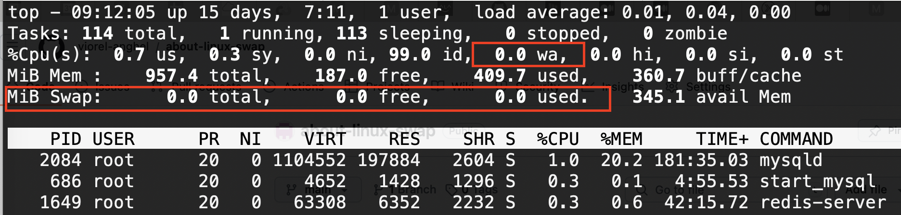
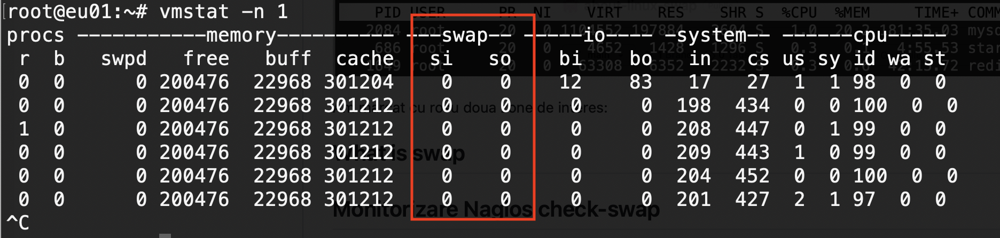

# WIP work in progress

# About Linux swap

This is an introductory article on the topic of swap with some applications on Linux operating system.

Copyright (2024) Viorel Anghel 

Original link: https://github.com/viorel-anghel/about-linux-swap

## What is Unix/Linux swap

The generic term for all operating systems is [Memory paging](https://en.wikipedia.org/wiki/Memory_paging) and it basically means the use of disk as a temporary solution when the main memory is not enough (obviously with some performance penalty). In Unix and derived systems, like Linux, the term *swap* is used.  

## Why do we talk about swap?

We use a monitoring system that, among other things, tracks how much swap is used on physical or virtual machines. We recently decided not to monitor swap on virtual machines anymore, for several reasons:

- on most VMs we really don't have swap setup. First of all, because if a VM is swapping, the performance is seriously compromised. In the same vein, the Kubernetes project recommends disabling swap on the VMs used in a Kubernetes cluster
- the problem with these VMs where we don't have swap setup is that the monitoring system sends an alarm like "swap unknown", but more about that at the end
- [LOAD average](https://en.wikipedia.org/wiki/Load_(computing)) monitoring is a good enough indication that something is wrong on a VM and needs to be investigated. It could be the intensive use of swap or something else that will increase the LOAD average.

## Swap commands

Memory and swap status can be shown with the command `free` but the dedicated command for swap is `swapon`, used to activate or show swap status. There is a counterpart `swapoff` used to disable swap. To see the swap status, the flag `-s` (summary) is used:

```
# swapon -s

Filename				Type		Size		Used		Priority
/dev/dm-0                               partition	8388604		0		-2
```

In the above example you see a dedicated partition (`/dev/dm-0`) is used as swap. 
In Linux you may also setup a simple file to be used as swap.

## Setting up swap

There are countless of webpages describing this in detail so I'll give here only a brief version:

```
# run as root or prefix all commands with sudo

dd if=/dev/zero of=/swapfile bs=1M count=1024  # create 1024MB empty file
                                               # named /swapfile
mkswap /swapfile      # format the file for swap usage
chmod 600 /swapfile   # set restrictive permissions
swapon /swapfile      # activate swap

# edit /etc/fstab to make it permanent

```

## Using top to check swap

This is a partial screenshot of the `top` command on Linux:



I marked in red two areas of interest:
- the part *MiB Swap:* - it is self-explanatory, how many Swap MB we have in total, free and used. In this particular case, this VM does not have swap.
- more interesting, the area where *0.0 wa* - this means what percentage of the CPU is used in "wait for I/O" state, that is, the processor is waiting for I/O operations, usually disk activity. That's not necessarily swap, it can be heavy disk write/read operations. But it can also be a swap.

As a side note, you should know very clearly everything written on the *%CPU* line in the top command. 
In short, they are percentages of the time used by the processor for:
- us = user processes (i.e. non-kernel)
- sy = system processes (i.e. kernel)
- ni = nice - processes (user space) with non-default priority
- id = idle - the processor is idle
- wa = I just explained, wait for i/o
- hi = hardware interrupts
- si = software interrupts
- st = stolen from this VM by the hypervisor

How can we know all this? Simple, `man top`. The ones I look at first are `id`le and `wa`it.

# Using vmstat to see swap usage

Until now, we do not have a command that clearly indicates if there is a write / read activity on the swap. 
The one I use frequently is `vmstat' with the arguments `-n 1', 
which means that it shows periodically, every 1 second, the information:



Obviously, for what we were discussing, the *swap* column is of interest. *si* means *swap in*, i.e. blocks transferred from memory to disk. *so* means *swap out*, i.e. blocks brought from disk (swap) into memory to be used.

If you're curious, the next two columns shows *io/bi bo* are disk blocks in / out, i.e write/read on disks.
 
On a system that is swapping, the rate of change over time in *so* is the important parameter to follow, with the idea that swap-in is not serious as long as there is not much swap-out.

For the other numbers and information from the screenshot above, I hope you already know, `man vmstat`. Some parameters are the same as at the top (cpu / us sy id wa st).

## Swappiness

This is a kernel parameter describing how aggressive the kernel will try to use swap. 
The swappiness value can range from 0 to 100, the default value is 60. 
Higher values will increase aggressiveness, lower values decrease the swap usage.
A value of 0 instructs the kernel not to initiate swap until critical. 

If you want to check/change this:

```
cat /proc/sys/vm/swappiness  # show the value

echo 10 >/proc/sys/vm/swappiness # set the value to 10 
sysctl vm.swappiness=10          # another way to set the value to 10

# edit /etc/sysctl.conf to make it persistent
```

As a side note, you don't need to reboot or restart nothing after a change in `/proc/sys` or `sysctl`, 
those values will be noticed by the kernel on-the-fly.

## Monitorizare Nagios check-swap

The Nagios monitoring system has a plugin `check_swap`, usually at `/usr/lib/nagios/plugins/check_swap`. 

The default result is used on a machine without swap is `CRITICAL` but the plugin offers a flag to change that:

```
/usr/lib/nagios/plugins/check_swap --allswaps --no-swap=ok -w 30% -c 20%
```

This means:
- check all swap partitions and files, one by one (--allswaps) 
- it's OK if no swap detected (--no-swap=ok)
- warning at 30% swap space left (-w)
- critical at 20% swap space left (-c).

As you can see, it does monitor how much swap space is available, not, as I have said above, 
the "swap out" activity which is more relevant.

---

That's all for now

